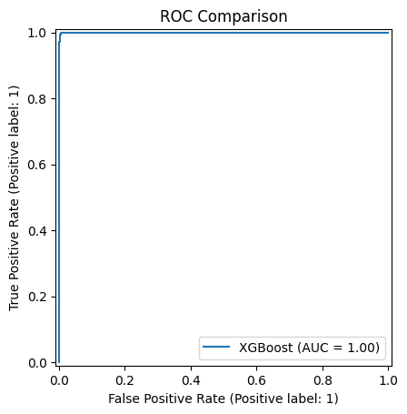
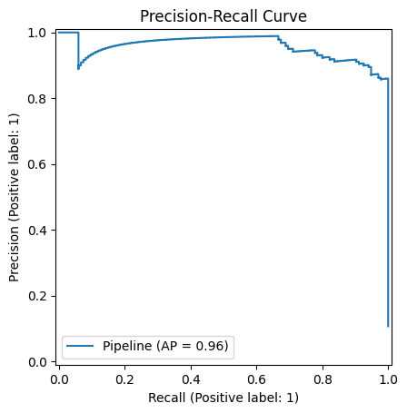
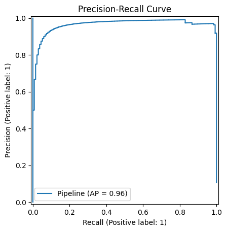
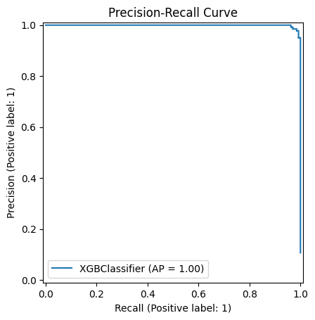
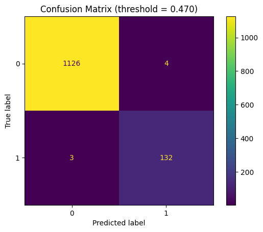
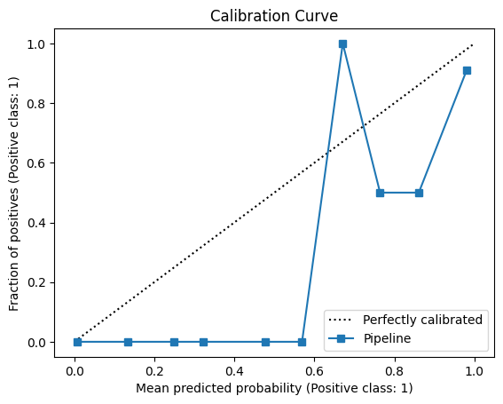
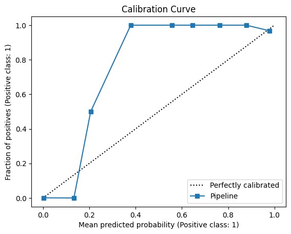
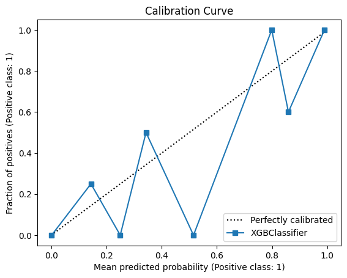
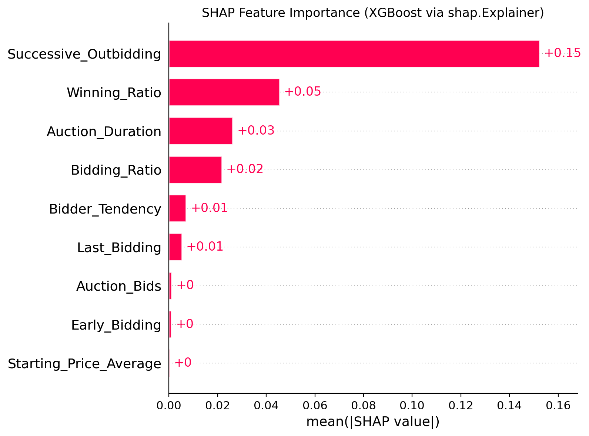

# Shill Bidding Fraud Detection – Machine Learning Pipeline


An end-to-end machine learning pipeline for detecting **shill bidding behavior in online auctions** using statistical modeling, modern ML algorithms, and explainable AI techniques.

The project demonstrates a production-style ML workflow including:

- Data preprocessing
- Train/validation/test splitting
- Hyperparameter tuning
- Threshold optimization
- Model comparison
- Evaluation visualization
- Feature importance analysis
- SHAP explainability
- Model persistence and artifact generation

---
## Quick Results (Validation)

- **Dataset:** 6,321 rows • 9 features • Fraud rate **10.68%**
- **Best model:** **XGBoost**
- **Best F1:** **0.981** (val)
- **Best ROC-AUC:** **0.9996** (val)
- **Best threshold (F1-optimized):** **0.46**

**XGBoost @ threshold = 0.46 (Test confusion matrix)**  
TN=1127 • FP=3 • FN=2 • TP=133

# Project Overview

Shill bidding is a fraudulent auction practice where sellers artificially inflate prices by placing fake bids.

This project builds predictive models that detect these patterns using behavioral bidding features extracted from auction data.

Three models are evaluated:

| Model | Purpose |
|-----|-----|
| Logistic Regression | Statistical baseline |
| SVM (RBF Kernel) | Nonlinear decision boundary |
| XGBoost | Gradient boosted tree ensemble |

The pipeline automatically:

1. Tunes model hyperparameters
2. Selects optimal probability thresholds
3. Evaluates performance on a held-out test set
4. Generates diagnostic plots
5. Saves trained models and metrics

---
```
## Dataset

This project uses the **Shill Bidding Dataset** from the **UCI Machine Learning Repository**.

The dataset contains behavioral features designed to identify **fraudulent bidding activity (shill bidding)** in online auctions. These features capture bidding patterns that may indicate attempts to artificially inflate auction prices.

Dataset source:

UCI Machine Learning Repository  
Shill Bidding Dataset  
http://archive.ics.uci.edu/ml/datasets/Shill+Bidding+Dataset

Summary of the dataset used in this project:

- Observations: **6,321**
- Features: **9**
- Fraud cases: **675 (10.68%)**
- Normal cases: **5,646 (89.32%)**

The target variable indicates whether a bidder is engaging in **shill bidding behavior (fraudulent)** or **normal bidding behavior**.

Note: The dataset is not included in this repository.  
Please download it from the UCI repository and place it in:

```

### Dataset Summary

| Metric | Value |
|-----|-----|
Observations | **6,321 auctions**
Features | **9 behavioral bidding features**
Target variable | **Class (0 = normal, 1 = shill bidding)**

### Class Distribution

| Class | Meaning | Count | Percentage |
|-----|-----|-----|-----|
0 | Normal bidding | 5,646 | 89.32%
1 | Shill bidding | 675 | 10.68%

This represents a **moderately imbalanced fraud detection problem**, which motivates the use of:

- Precision–Recall curves
- F1-optimized thresholds
- ROC analysis

---

## Model Performance (Validation)

| Model | Best Hyperparameters | F1 Score | ROC-AUC |
|-----|-----|-----|-----|
Logistic Regression | C = 0.3 | 0.899 | 0.995 |
SVM (RBF) | C = 10, γ = scale | 0.967 | 0.999 |
XGBoost | depth=6, lr=0.03, trees=300 | **0.981** | **0.9996**

XGBoost achieved the best performance and was selected as the final model.

---

## ROC Curve Comparison

The figure below compares all trained models.



XGBoost dominates the ROC space with near-perfect separation.

---

## Precision-Recall Curves

Precision-Recall curves are particularly important for fraud detection tasks with class imbalance.

### Logistic Regression



### SVM (RBF)



### XGBoost



---

## Confusion Matrices (Optimized Thresholds)

### Logistic Regression


### SVM (RBF)



### XGBoost


For XGBoost:

| Metric | Value |
|-----|-----|
True Negatives | 1127 |
False Positives | 3 |
False Negatives | 2 |
True Positives | 133 |

The model successfully detects fraudulent bidding with extremely low error rates.

---

## Why Threshold Optimization?

Fraud detection is rarely best served by the default probability cutoff (0.5).  
This pipeline selects a **best threshold on the validation set** by maximizing **F1 score**, then reports confusion matrices using that optimized threshold.

## Calibration Analysis

Calibration curves assess whether predicted probabilities reflect true outcome frequencies.

### Logistic Regression



### SVM



### XGBoost



---

## Explainability (SHAP)

To understand model decisions, SHAP values were used to estimate feature contributions.



### Top Predictive Signals

| Feature | Interpretation |
|-----|-----|
Successive_Outbidding | Repeated self-outbidding behavior |
Winning_Ratio | Abnormally high win rates |
Auction_Duration | Manipulation of auction timing |
Bidding_Ratio | Aggressive bidding relative to competitors |
Bidder_Tendency | Behavioral bidder patterns |
Last_Bidding | Strategic late bidding behavior |

These patterns align with known **auction fraud behaviors**.

---

## Key Figures

**ROC Comparison**


**XGBoost Precision–Recall**


**XGBoost Confusion Matrix (threshold optimized)**


**SHAP Feature Importance (XGBoost)**


```markdown

### Project Structure

shill-bidding-ml-pipeline
│
├── data
│ └── raw
│ └── shill_bidding.csv
│
├── reports
│ ├── figures
│ │ ├── roc_comparison.png
│ │ ├── pr_logistic.png
│ │ ├── pr_svm_rbf.png
│ │ ├── pr_xgb.png
│ │ ├── cm_logistic_thr.png
│ │ ├── cm_svm_rbf_thr.png
│ │ ├── cm_xgb_thr.png
│ │ ├── cal_logistic.png
│ │ ├── cal_svm_rbf.png
│ │ ├── cal_xgb.png
│ │ └── shap_summary_xgb.png
│ │
│ ├── models
│ └── metrics.json
│
├── src
│ ├── data.py
│ ├── split.py
│ ├── models.py
│ ├── train.py
│ ├── metrics.py
│ ├── plots.py
│ ├── thresholds.py
│ └── persist.py
│
├── main.py
└── requirements.txt

```

---

# How to Run the Project

## Reproducibility Notes

This project was tested on macOS with a dedicated Conda environment.

If XGBoost fails to load with an OpenMP error, install OpenMP:

bash
brew install libomp

### Install dependencies

conda create -n fraud-ml python=3.11
conda activate fraud-ml
pip install -r requirements.txt


### Run the training pipeline
python main.py


The script will:

- Train all models
- Evaluate performance
- Generate plots
- Save artifacts to `reports/`

---

```
Note: On some macOS systems, XGBoost may fail to load due to missing OpenMP support. If this occurs, install OpenMP using `brew install libomp`.
```
---

##  Add a “Model Artifacts” table 

Add this section:


## Saved Artifacts

After running `python main.py`, the pipeline writes:

| Artifact | Path |
|---|---|
| Metrics summary | `reports/metrics.json` |
| Trained models | `reports/models/` |
| ROC curves | `reports/figures/roc_*.png` |
| PR curves | `reports/figures/pr_*.png` |
| Calibration plots | `reports/figures/cal_*.png` |
| Confusion matrices | `reports/figures/cm_*_thr.png` |
| Permutation importance | `reports/figures/permutation_importance_*.csv` |
| SHAP summary | `reports/figures/shap_summary_xgb.png` |

```
# Generated Outputs

The pipeline automatically produces:

reports/
│
├── figures/
│ ├── ROC curves
│ ├── Precision-Recall curves
│ ├── Calibration plots
│ ├── Confusion matrices
│ └── SHAP explainability plots
│
├── models/
│ └── trained model files
│
└── metrics.json

```


---

# Technologies Used

- Python
- Scikit-Learn
- XGBoost
- SHAP
- Pandas
- NumPy
- Matplotlib

---

# Author

**Padmore Nana Prempeh**

Machine Learning • Data Science • Statistical Modeling • Data Engineering


---

# Future Improvements

Possible extensions include:

- Cross-validation model selection
- MLflow experiment tracking
- Hyperparameter optimization via Optuna
- Feature engineering using auction time dynamics
- Deployment via REST API


